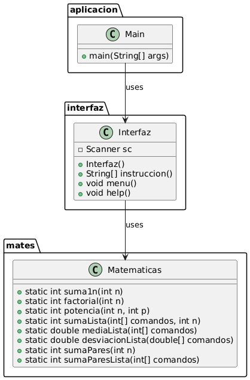

# Aplicación de Operaciones Matemáticas

## Descripción

Esta aplicación de Java proporciona una interfaz de usuario para realizar varias operaciones matemáticas a través de un menú interactivo. Las operaciones incluyen suma, factorial, potencia, suma de listas, media aritmética, desviación típica, suma de números pares, y producto escalar de dos listas.

## Estructura del Proyecto

El proyecto está organizado en tres paquetes principales:

1. **aplicacion**: Contiene la clase principal `Main` que inicia la aplicación.
2. **interfaz**: Contiene la clase `Interfaz` que maneja la interacción con el usuario.
3. **mates**: Contiene la clase `Matematicas` que implementa las operaciones matemáticas.

## Clases y Métodos

### Clase `Main` (paquete `aplicacion`)

- `public static void main(String[] args)`: Método principal que inicia la aplicación creando una instancia de `Interfaz` y llamando al método `menu`.

### Clase `Interfaz` (paquete `interfaz`)

- `public Interfaz()`: Constructor que inicializa el objeto `Scanner`.
- `public String[] instruccion()`: Lee una línea de entrada del usuario y la divide en un array de strings.
- `public void menu()`: Muestra el menú de opciones y maneja la lógica de interacción con el usuario.
- `public void help()`: Muestra las instrucciones disponibles para el usuario.

### Clase `Matematicas` (paquete `mates`)

- `public static int suma1n(int n)`: Calcula la suma de los números del 1 al `n`.
- `public static int factorial(int n)`: Calcula el factorial de `n`.
- `public static int potencia(int n, int p)`: Calcula la potencia de `n` elevado a `p`.
- `public static int sumaLista(int[] comandos)`: Calcula la suma de los elementos de una lista.
- `public static double mediaLista(int[] comandos)`: Calcula la media aritmética de los elementos de una lista.
- `public static double desviacionLista(double[] comandos)`: Calcula la desviación típica de los elementos de una lista.
- `public static int sumaPares(int n)`: Calcula la suma de los números pares hasta `n`.
- `public static int sumaParesLista(int[] comandos)`: Calcula la suma de los números pares en una lista.
- `public static int[] obtenerParesLista(int[] comandos)`: Obtiene una lista de números pares a partir de otra lista.
- `public static int[] numerosParesLista(int n)`: Genera una lista de los primeros `n` números pares.
- `public static int productoEscalar(int[] comandos1, int[] comandos2)`: Calcula el producto escalar de dos listas.

## Uso

Para ejecutar la aplicación, simplemente compila y ejecuta la clase `Main`. El menú interactivo te permitirá seleccionar y realizar diferentes operaciones matemáticas.

## Diagrama UML

## Autor
Luis Holgado Arranz y Juan Manuel Mbela Ela